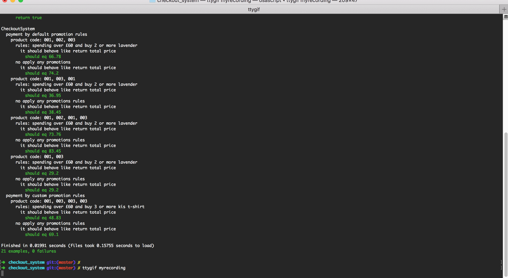

# Checkout System

Our client is an online marketplace; here is a sample of some of the products available on the site:

Product code  | Name           | Price
--------------|----------------|------------------
001           | Lavender heart         | £9.25
002           | Personalised cufflinks | £45.00
003           | Kids T-shirt           | £19.95

This is just an example of products, your system should be ready to accept any kind of product.

Our marketing team wants to offer promotions as an incentive for our customers to purchase these items.

If you spend over £60, then you get 10% off of your purchase. If you buy 2 or more lavender hearts then the price drops to £8.50.

Our check-out can scan items in any order, and because our promotions will change, it needs to be flexible regarding our promotional rules.

The interface to our checkout looks like this (shown in Ruby):

```
co = Checkout.new(promotional_rules)
co.scan(item)
co.scan(item)
price = co.total
```

Implement a checkout system that fulfills these requirements in TDD (Test Driven Development)

```
Test data
---------
Basket: 001,002,003
Total price expected: £66.78
Basket: 001,003,001
Total price expected: £36.95
Basket: 001,002,001,003
Total price expected: £73.76
```
## Installation

 - Prerequisite:
   + Ruby
   + bundler

- run `gem install bundler` to install `bundler`
- run `bin/setup` to install dependencies

## Usage

- run `bundle exec rspec` to run all specs

## Result Specs

[](result_rspec.gif)